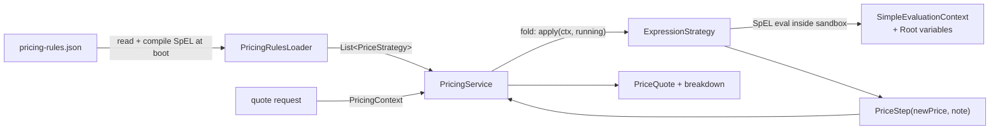

# Flight Booking System

A Spring Boot monolith that implements the flight-booking design (search /
view / reserve / confirm / cancel). Concurrency for seat booking is handled
entirely by **Redis** (`SET key value NX EX 300`) — no DB locks, no
`@Version` optimistic checks, no in-process semaphores.

## Functional coverage

- [x] Search flights — direct + multi-stop itineraries (up to `app.search.max-stops-cap`) stitched at query time (`GET /flights`)
- [x] View flight + seat map, with real-time LOCKED state overlaid from Redis (`GET /flights/{id}`)
- [x] Two-phase itinerary flow: `POST /itinerary/reserve` → `POST /itinerary/{itineraryId}/confirm`, both scoped by an `X-Idempotency-Key` session header
- [x] **Multi-leg itineraries are first-class**: reserve takes a `legs` array, and every stage (reserve, confirm, cancel) is all-or-nothing across every leg
- [x] View itinerary (`GET /itinerary/{itineraryId}`)
- [x] Cancel + refund + waitlist promotion (`POST /itinerary/{itineraryId}/cancel`)
- [x] Itinerary + legs persisted at reserve time, so a payment-gateway success followed by a DB failure is always traceable
- [x] Dynamic pricing where **all math lives in a policy-team-owned JSON** — each rule is a sandboxed SpEL formula, Java holds only the runtime

## Concurrency model

The only concurrency barrier is `SET NX EX` on one Redis key per (flight, seat):

```
key:   seat:{flightId}:{seatId}
value: <client's X-Idempotency-Key from the reserve request>
ttl:   5 minutes (app.reservation.ttl-minutes)
```

Consequences:

- **Two users can never hold the same seat.** `SET NX` is atomic — exactly
  one concurrent reserve wins. The loser gets a fast 409 without touching
  the DB.
- **The lock value doubles as an owner-tag.** Callers pass their
  `X-Idempotency-Key` header both to reserve (which becomes the lock
  value) and confirm (which asserts the lock still holds *that* value
  via a plain `GET` before charging). This is what makes the "gateway
  charged us but the seat is gone" race structurally impossible on the
  happy path: if the lock is ours, no one else has confirmed or reserved
  this seat, so the {@code flight_seats} INSERT that follows is safe.
- **Safe release.** `release` runs the standard `if get == expected then
  del` Lua one-liner (in the Redis backend) or the equivalent
  `ConcurrentHashMap#computeIfPresent` in the in-memory backend, so a
  late release from an expired holder can't wipe a fresh holder's key.
- **Itinerary + legs are the durable anchor.** Unlike the earlier design
  where in-flight reservations lived only in Redis, the `itineraries`
  row (plus one `bookings` row per leg) is created at reserve time in
  `RESERVED` state. That's the fix for the "charged but no record" gap:
  if the confirm transaction rolls back after a real gateway has
  committed a charge, the retry can find the same Itinerary + the same
  Payment (dedup'd by `payments.idempotency_key`) and finish the job —
  no orphaned money.
- **Multi-leg atomicity via canonical lock ordering.** When a caller
  reserves an N-leg itinerary, the service sorts the legs by
  `(flightId, seatId)` and acquires the N Redis locks in that
  canonical order. Two callers reserving overlapping legs in opposite
  orders both try the smallest key first — one wins, the other bails
  immediately with a 409 (no mutual-deadlock lose-lose). If any lock
  fails partway through, the ones already held are released in reverse
  order and no itinerary is persisted.
- **Redis is off the hot path for reads.** The seat-map overlay in
  `GET /flights/{id}` is one `MGET seat:F:1 seat:F:2 …` — presence
  means LOCKED, absence means whatever the DB says
  (BOOKED / AVAILABLE). The lock value never leaves the server.
- **`flight_seats` UNIQUE(flight_id, seat_id)** is the DB-level last-line
  defence. With the Redis lock check gating the confirm path, we should
  never actually hit it in practice.

## Itinerary flow: reserve → confirm, idempotency-keyed both ends

An **itinerary** is the atomic unit of a trip — a direct flight is a
size-1 itinerary, a two-hop trip is size-2, and so on. Reserve,
confirm, and cancel all operate on the whole itinerary: they either
succeed for every leg or fail for every leg. There's no half-booked
state where "leg 1 is CONFIRMED but leg 2 is still RESERVED".

The whole reserve-plus-confirm cycle is scoped by one client-generated
value: the `X-Idempotency-Key` header. The client mints it (typically a
UUID) before it calls `POST /itinerary/reserve` and re-uses it verbatim
on `POST /itinerary/{itineraryId}/confirm`. Everywhere it lands, it's
used to turn "do this thing" into "do this thing at most once":

- On the `itineraries` row it's a unique column, so a retried reserve
  returns the same `itineraryId` instead of double-writing.
- On **every leg's** Redis seat lock it's the owner-tag, so confirm can
  prove each lock is still ours (via a plain `GET`) before doing
  anything expensive.
- On the `payments` row it's a unique column, so a retried charge
  short-circuits to the existing `Payment` instead of double-charging.
- On the wire out to the payment gateway it's what would be forwarded
  as Stripe's `Idempotency-Key` header — the same defence, one hop out.

### `POST /itinerary/reserve` — creates the durable Itinerary + legs

Body: `{ "legs": [{ "flightId", "seatId" }, ...] }`. A direct flight
is a size-1 `legs` array. Headers: `X-User-Id`, `X-Idempotency-Key`.

Server steps:

1. `itineraryRepository.findByIdempotencyKey(key)` — if a row already
   exists, verify the caller owns it AND asked for the same legs in
   the same order, then return it. First guard against a duplicate
   submit from the browser.
2. Reject a request that names the same `(flightId, seatId)` twice
   (a duplicate leg is ambiguous — one traveller can't sit in the
   same seat for two legs of their own trip).
3. For each leg: validate flight/seat, verify the seat isn't already
   booked, run the pricing chain to get per-leg `finalPrice`.
4. Sort the legs by `(flightId, seatId)` and acquire the N Redis
   locks in that canonical order. If any lock fails, release the
   ones already held in reverse order and return 409 — no partial
   reservation is ever persisted.
5. INSERT one `itineraries` row + N `bookings` legs (in the caller's
   order, so `legOrder = 0, 1, 2, ...` reflects the trip sequence).
6. Return the full `BookingItineraryDto` including per-leg
   `finalPrice` and `priceBreakdown`, aggregated `totalFinalPrice`,
   and the `expiresAt` that every leg's lock shares.

If the INSERT throws after the locks are held, the `catch` block
releases every acquired lock so no seat is held out of the pool for
the whole TTL.

### `POST /itinerary/{itineraryId}/confirm` — one transactional method

Body: `{ "paymentMethod" }`. Headers: `X-User-Id`, `X-Idempotency-Key`.

The service method is a single `@Transactional`. In order:

1. Load `itineraries` (with all N legs eager-fetched); 404 if missing.
2. Verify caller owns it (`itinerary.user.id == X-User-Id`). Same
   generic message either way — no info leak.
3. Verify `itinerary.idempotencyKey == X-Idempotency-Key`. A stolen
   `itineraryId` alone can't be confirmed.
4. If `status == CONFIRMED` → return the cached DTO (idempotent
   replay). If `status == CANCELLED` → 409.
5. **Trust anchor** — for every leg, `seatLockService.isHeldBy(fid,
   sid, idempotencyKey)`. If **any** leg's lock has expired or been
   recycled, refuse **before** touching the payment gateway. This is
   what makes "charged but the seat is gone" impossible on the happy
   path.
6. `PaymentService.charge(itinerary, itinerary.finalPrice, method,
   idempotencyKey)` — one aggregated charge for the whole trip.
   Dedupes on `payments.idempotency_key`, so a retried confirm
   reuses the existing CHARGE row instead of double-charging.
7. INSERT one `flight_seats` row per leg. `UNIQUE(flight_id,
   seat_id)` is the DB last-line defence.
8. Flip the itinerary to `CONFIRMED`, set `payment` and
   `confirmedAt`.
9. Compare-and-delete every leg's Redis lock (best-effort).
10. Maybe flip `flights.fullyBooked` per unique flight in the
    itinerary, fire notification, return DTO.

Because everything from step 6 onwards is inside one DB transaction,
a mid-flight crash rolls back cleanly and the client can safely
retry with the same idempotency key. Because the trust anchor at
step 5 rejects stale reservations before any charge, we never have
the "charge committed, DB rolled back, retry re-charges" problem on
the happy path — and on the sad path where a real gateway did charge
us but our tx rolled back, the retry finds the existing Payment via
`payments.idempotency_key` and reuses it.

### `POST /itinerary/{itineraryId}/cancel` — cascades across every leg

Only **CONFIRMED** itineraries are cancellable. A RESERVED itinerary
has no payment to refund and no `flight_seats` rows to release; its
Redis locks expire on their own after the TTL, so "cancel" would be
a no-op and is rejected with a 409 instead of silently succeeding.

The client mints a **fresh** `X-Idempotency-Key` for every cancel
session (distinct from the reserve/confirm session's key). Then:

1. DELETE every leg's `flight_seats` row.
2. Flip the itinerary to `CANCELLED`, stamp the cancel key on
   `itineraries.cancellation_idempotency_key`.
3. `PaymentService.refund(itinerary.payment.id, "refund:" + key)` —
   one refund covers the whole trip. The `refund:` namespace prevents
   a caller that (against contract) reuses the confirm key on cancel
   from colliding with the CHARGE row on `payments.idempotency_key`.
4. For each unique flight touched by the itinerary: clear
   `fully_booked` if set, fan out "seat opened" notifications to
   every waitlisted user on that flight.

### Response shapes

**Happy path** — `BookingItineraryDto` from every mutating endpoint:

```json
{
  "itineraryId": 501,
  "userId": 1,
  "status": "RESERVED",
  "totalFinalPrice": 6400.00,
  "reservedAt": "…", "expiresAt": "…",
  "confirmedAt": null, "cancelledAt": null,
  "legs": [
    { "bookingId": 900, "legOrder": 0, "flightId": 3, "source": "BLR", "destination": "HYD",
      "seatId": 1, "seatNumber": "1A", "finalPrice": 3200.00, "priceBreakdown": [ … ] },
    { "bookingId": 901, "legOrder": 1, "flightId": 4, "source": "HYD", "destination": "BOM",
      "seatId": 7, "seatNumber": "1A", "finalPrice": 3200.00, "priceBreakdown": [ … ] }
  ],
  "message": "Reserved. Confirm within 5 minutes."
}
```

`priceBreakdown` is populated only on the reserve response (where the
pricing chain just ran); it's `null` on confirm / cancel / get replies.

**409 conflicts** — same `ApiError` envelope as the rest of the API:

- `Seat N on flight F is currently being booked by someone else` —
  lost the Redis `SET NX` race for that leg at reserve time.
- `Duplicate leg in request: flightId=F seatId=S` — same
  `(flightId, seatId)` appeared twice in the `legs` array.
- `Idempotency key already used for a different reservation` —
  reserve replay with the same key but different legs (order-sensitive).
- `Idempotency key belongs to a different user` — reserve idempotency
  hit landed on an itinerary owned by someone else.
- `Reservation not found for this user` — confirm / cancel caller
  isn't the itinerary's owner (generic message so a probe can't
  distinguish "wrong user" from "no such itinerary").
- `Idempotency key does not match reservation` — confirm caller sent
  the wrong idempotency key.
- `Reservation expired; please reserve again` — one of the itinerary's
  legs no longer holds its Redis lock (TTL fired or was recycled).
- `Booking has been cancelled` — confirm was called on a CANCELLED
  itinerary.
- `Only confirmed itineraries can be cancelled; a reservation will
  expire on its own` — cancel on a RESERVED itinerary.
- `Itinerary is already CANCELLED` — cancel replay with a different
  key on an already-cancelled itinerary.

### Post-TTL retry

If the client waits past the seat-lock TTL (default 5 minutes) before
calling confirm, the trust-anchor check refuses the confirm. The
`itineraries` row is still there in RESERVED state (unpaid) — the
client should start over with a fresh reservation. There is no
automated sweeper today: RESERVED itineraries are harmless because no
`flight_seats` rows exist for their legs, so anyone else's fresh
reserve can grab the same seats once the Redis locks clear.

If confirm previously succeeded but the response was lost in flight,
the client just retries with the same `itineraryId` +
`X-Idempotency-Key` — step 4 short-circuits to the cached CONFIRMED
DTO.

### End-to-end retry demo

```bash
KEY=$(uuidgen)  # one key for the whole reserve → confirm session

# 1. Reserve a single-leg (direct) itinerary — server creates one
#    itineraries row + one bookings leg + grabs the Redis lock.
ITID=$(curl -s -X POST http://localhost:8080/itinerary/reserve \
     -H 'Content-Type: application/json' \
     -H 'X-User-Id: 1' \
     -H "X-Idempotency-Key: $KEY" \
     -d '{"legs":[{"flightId":1,"seatId":1}]}' | jq -r .itineraryId)
echo "itineraryId: $ITID"

# 2. Duplicate reserve with the SAME key — same itineraryId, no new rows
curl -s -X POST http://localhost:8080/itinerary/reserve \
     -H 'Content-Type: application/json' \
     -H 'X-User-Id: 1' \
     -H "X-Idempotency-Key: $KEY" \
     -d '{"legs":[{"flightId":1,"seatId":1}]}' | jq .itineraryId
# → same $ITID

# 3. Confirm — one @Transactional does one aggregated charge +
#    N flight_seats inserts + status flip.
curl -s -X POST "http://localhost:8080/itinerary/$ITID/confirm" \
     -H 'Content-Type: application/json' \
     -H 'X-User-Id: 1' \
     -H "X-Idempotency-Key: $KEY" \
     -d '{"paymentMethod":"CARD"}' | jq
# → 200 BookingItineraryDto with status=CONFIRMED

# 4. Duplicate confirm — cached DTO, no re-charge, no re-INSERT.
curl -s -X POST "http://localhost:8080/itinerary/$ITID/confirm" \
     -H 'Content-Type: application/json' \
     -H 'X-User-Id: 1' \
     -H "X-Idempotency-Key: $KEY" \
     -d '{"paymentMethod":"CARD"}' | jq .status
# → "CONFIRMED"

# 5. Wrong key on confirm — 409, refused before touching the gateway.
curl -i -X POST "http://localhost:8080/itinerary/$ITID/confirm" \
     -H 'Content-Type: application/json' \
     -H 'X-User-Id: 1' \
     -H "X-Idempotency-Key: not-the-right-key" \
     -d '{"paymentMethod":"CARD"}'
# → HTTP/1.1 409  "Idempotency key does not match reservation"
```

### Multi-leg demo — reserving a two-hop trip atomically

```bash
KEY=$(uuidgen)

# Reserve BLR → HYD → BOM in one shot. Both seat locks are taken
# in canonical (flightId, seatId) order under the hood so a
# concurrent caller reserving the same two legs in the opposite
# order can't deadlock with us — exactly one of us wins the whole
# itinerary. Seat ids are looked up from the live seat maps below
# instead of being hardcoded, because each aircraft model has its
# own Seat rows.
LEG1_SEAT=$(curl -s http://localhost:8080/flights/3 \
             | jq '[.seats[] | select(.status=="AVAILABLE")][0].seatId')
LEG2_SEAT=$(curl -s http://localhost:8080/flights/4 \
             | jq '[.seats[] | select(.status=="AVAILABLE")][0].seatId')

ITID=$(curl -s -X POST http://localhost:8080/itinerary/reserve \
     -H 'Content-Type: application/json' \
     -H 'X-User-Id: 1' \
     -H "X-Idempotency-Key: $KEY" \
     -d "{\"legs\":[
            {\"flightId\":3,\"seatId\":$LEG1_SEAT},
            {\"flightId\":4,\"seatId\":$LEG2_SEAT}
          ]}" | jq -r .itineraryId)

# One confirm covers both legs — one CHARGE row, two flight_seats rows.
curl -s -X POST "http://localhost:8080/itinerary/$ITID/confirm" \
     -H 'Content-Type: application/json' \
     -H 'X-User-Id: 1' \
     -H "X-Idempotency-Key: $KEY" \
     -d '{"paymentMethod":"CARD"}' | jq '.status, (.legs | length)'
# → "CONFIRMED", 2
```

## Search: itineraries via bounded backward expansion

Every persisted flight is a **direct point-to-point segment** — there is no
`stops` column. Multi-stop trips (up to `app.search.max-stops-cap` layovers,
default 3) are stitched together at read time.

Search runs **backwards from the destination** — start with flights
arriving where the user wants to go, then walk backwards through connecting
flights until a leg starts at the user's source. This keeps the initial
result set small (destinations are usually leafier than sources) and lets
the strictest layer of pruning happen at Query 1.

**How `GET /flights?source=X&destination=Y&date=D&maxStops=…` executes:**

1. **Spine — inbound to destination.**
   `SELECT * FROM flights WHERE destination = Y
    AND startTime IN [D, D+1d) AND fullyBooked = false`
   - Rows whose `source = X` become **direct** itineraries.
   - Rows whose `source ≠ X` are candidate **last legs** of multi-hop trips.
2. **Backward expansion** — for each candidate last leg, recursively
   prepend feeder flights, up to `min(userMaxStops, cap)` extra hops:
   - **Intermediate hop:** `SELECT * FROM flights WHERE destination = hub
     AND endTime BETWEEN leg.startTime - maxLayover
                     AND leg.startTime - minLayover
     AND fullyBooked = false`
     (any source — a candidate hub could feed from anywhere).
   - **Deepest allowed hop:** same query but with `source = X` — only a
     userSource-rooted feeder can actually close the itinerary anyway, so
     we push that filter down to the DB.
   - **Cycle guard**: never prepend a feeder whose source is already an
     airport on the path — otherwise a 3-stop search would happily emit
     `BLR→HYD→BLR→HYD→BOM`.
   - Whenever a prepended feeder has `source = X`, the path is emitted
     (further backward extension would loop through the origin).

**Config knobs:**

| Property                            | Default | What it caps                                                |
| ----------------------------------- | ------- | ----------------------------------------------------------- |
| `app.search.min-layover-minutes`    | 60      | Minimum transfer time between segments                      |
| `app.search.max-layover-hours`      | 12      | Maximum transfer time — beyond this it isn't a "connection" |
| `app.search.max-stops-cap`          | 3       | Hard cap on stops; `maxStops` query param is clamped to this |

`maxStops` in the query is clamped: request `maxStops=99` and you get at
most 3 stops. Request `maxStops=1` and 2-/3-stop itineraries are dropped.

Response segments are always in **chronological order** — feeder first,
then each connecting leg, then the flight into the destination —
regardless of the internal backward-search direction.

**Response** — `List<ItineraryDto>`:

```json
[
  {
    "stops": 0,
    "startTime": "…T14:00Z", "endTime": "…T16:30Z",
    "totalDurationMinutes": 150, "layoverMinutes": 0,
    "totalPrice": 3520.00,
    "segments": [ { "source": "BLR", "destination": "BOM", … } ]
  },
  {
    "stops": 1,
    "startTime": "…T09:00Z", "endTime": "…T14:00Z",
    "totalDurationMinutes": 300, "layoverMinutes": 120,
    "totalPrice": 6150.00,
    "segments": [
      { "source": "BLR", "destination": "HYD", … },
      { "source": "HYD", "destination": "BOM", … }
    ]
  }
]
```

**Sort:**

- `CHEAPEST` → by `totalPrice` (sum of segment `estimatedPrice`s), tie-break
  on shorter total duration.
- `FASTEST`  → by `totalDurationMinutes` (arrival − departure across the
  whole trip, inclusive of layover), tie-break on lower price.
- Omit the parameter → falls back to `CHEAPEST` (the default lives in
  `ItinerarySortService.DEFAULT_SORT`, not scattered across callers).

Sort orders are **not a `switch` in `FlightService`**. Each mode is a
`@Component` implementing `ItinerarySorter` in
`com.flightbooking.service.search`:

```java
public interface ItinerarySorter {
    SortBy type();                              // which enum value I handle
    List<ItineraryDto> sort(List<ItineraryDto> in);   // return a new sorted list
}
```

`ItinerarySortService` collects every discovered bean, indexes them in an
`EnumMap<SortBy, ItinerarySorter>`, and dispatches per request. Boot-time
checks make wiring mistakes loud:

- **Duplicate** — two beans claiming the same `SortBy` crash the app at
  startup naming both classes. No silent overwrite.
- **Gap** — every value of the `SortBy` enum must have exactly one bean.
  Adding `SortBy.SHORTEST_LAYOVER` without wiring `ShortestLayoverSorter`
  crashes at boot rather than at the first request that asks for it.

**Adding a new sort mode** is one enum entry + one file. Zero edits to
`FlightService`:

```java
// 1. add SortBy.SHORTEST_LAYOVER

// 2. new file: com.flightbooking.service.search.ShortestLayoverSorter
@Component
public class ShortestLayoverSorter implements ItinerarySorter {
    @Override public SortBy type() { return SortBy.SHORTEST_LAYOVER; }
    @Override public List<ItineraryDto> sort(List<ItineraryDto> in) {
        return in.stream()
                 .sorted(Comparator.comparingLong(ItineraryDto::layoverMinutes))
                 .toList();
    }
}
```

**maxStops:**

- `0` → direct itineraries only. Query 2 is skipped entirely.
- `≥ 1` (or unset) → direct + one-stop.

**Pricing efficiency.** Each unique `Flight` id involved in the result set
is priced exactly once, even if it appears as a leg in multiple candidate
itineraries. Booked-seat counts (needed by the demand-based rule) are
fetched in a single batched query.

## Dynamic pricing

**All pricing math lives in
[`src/main/resources/pricing-rules.json`](src/main/resources/pricing-rules.json)**,
owned by the policy team. Java holds only the runtime: a sandboxed SpEL
evaluator, BigDecimal precision, and fail-loud validation. Every rule —
base fare, demand curves, time-to-departure surge, taxes, route surcharges —
is a formula in that JSON. Editing pricing behavior is a config change plus
a restart. No rebuild. No Java review.

**How it works.** At boot, `PricingRulesLoader` reads the JSON, hands each
entry to `ExpressionStrategy.from(...)` which compiles the SpEL, and gives
`PricingService` an ordered list. `PricingService.quote(ctx)` folds each
strategy over the running price:



### Rule shape

Every entry in `strategies[]` has the same shape:

```json
{
  "name":    "demand-based",
  "type":    "expression",
  "order":   10,
  "formula": "currentPrice * (bookedRatio >= 0.90 ? 2.0 : bookedRatio >= 0.75 ? 1.5 : bookedRatio >= 0.50 ? 1.2 : 1.0)",
  "note":    "bookedRatio >= 0.90 ? '2.0x very high demand' : bookedRatio >= 0.75 ? '1.5x high demand' : bookedRatio >= 0.50 ? '1.2x moderate demand' : '1.0x low demand'"
}
```

- `formula` — SpEL, must return a number. This is the price arithmetic.
- `note` — SpEL, must return a string. Shown in the price breakdown; use a
  ternary chain to get per-branch labels ("2.0x very high demand" etc.) out
  of a single rule. String literals need single quotes.
- `order` — smaller values fire first. Convention: the first rule (order 0)
  seeds the running price by ignoring `currentPrice` (e.g. `formula: "baseFare"`).

### Variables the DSL exposes

Available on the SpEL root object ([`ExpressionStrategy.Root`](src/main/java/com/flightbooking/service/pricing/ExpressionStrategy.java)):

| Name               | Type         | Meaning                                             |
| ------------------ | ------------ | --------------------------------------------------- |
| `currentPrice`     | `BigDecimal` | Running price from the previous chain step          |
| `baseFare`         | `BigDecimal` | `flight.cost` — the seed fare                       |
| `bookedRatio`      | `double`     | `0.0..1.0`, fraction of seats sold                  |
| `hoursToDeparture` | `long`       | Whole hours between now and takeoff                 |
| `availableSeats`   | `long`       | Seats not booked                                    |
| `totalSeats`       | `int`        | Aircraft capacity                                   |
| `source`           | `String`     | Airport code (e.g. `"BLR"`)                         |
| `destination`      | `String`     | Airport code                                        |
| `flight`           | `Flight`     | Full entity — use for less common getters           |
| `now`              | `Instant`    | Quote timestamp                                     |

Extending this list is the ONE piece of code work in the pricing pipeline:
add a `getXxx()` on `ExpressionStrategy.Root`, ship it, and every future
formula can reference `xxx`.

### Shipped `pricing-rules.json`

Three rules, all expressions. Prices are byte-for-byte identical to the
original hand-coded strategies — the JSON is just where the math lives now:

| `order` | `name`              | `formula`                                                                                              |
| ------- | ------------------- | ------------------------------------------------------------------------------------------------------ |
| 0       | `base-fare`         | `baseFare`                                                                                             |
| 10      | `demand-based`      | `currentPrice * (bookedRatio >= 0.90 ? 2.0 : bookedRatio >= 0.75 ? 1.5 : bookedRatio >= 0.50 ? 1.2 : 1.0)` |
| 20      | `time-to-departure` | `currentPrice * (hoursToDeparture < 3 ? 2.0 : hoursToDeparture < 24 ? 1.5 : hoursToDeparture < 168 ? 1.1 : 1.0)` |

### Overriding the file location

Point at an external drop for prod (mounted ConfigMap, S3-synced file, etc.):

```yaml
app:
  pricing:
    rules-location: file:/etc/flightbooking/pricing-rules.json
```

### Sandbox / trust model

Formulas run inside
`SimpleEvaluationContext.forReadOnlyDataBinding().withInstanceMethods()` —
arithmetic, comparisons, ternary, and public methods on the root object are
allowed; `T(java.lang.Runtime).exec(...)`, constructors, and static type
references are **blocked**. Verified: a formula that tries to shell out
crashes at evaluation time and `Runtime.exec` is never reached. The sandbox
is defense in depth — the JSON is still policy-team-owned and should be
code-reviewed like any other config artifact.

### Fail-loud

- Missing file, empty file, unknown `type`, missing `formula`, or a
  malformed SpEL expression in `formula`/`note` all **crash the app at
  startup** with a precise message naming the offending entry.
- Runtime evaluation errors (divide by zero, sandbox violations) surface
  as **500s at quote time** with the rule name + raw formula in the message.
- Silent 1.0x-forever is not a failure mode.

### Estimated vs. final price

- **Estimated price** — returned by `GET /flights` and `GET /flights/{id}`.
  Computed on the fly, changes as demand and clock move. Non-binding — this
  is a quote.
- **Final price** — computed by `POST /itinerary/reserve` and persisted
  onto each `bookings` leg's `finalPrice` column (per-leg) and the
  parent `itineraries.finalPrice` (aggregated sum). At
  `POST /itinerary/{itineraryId}/confirm` we charge <em>exactly the
  aggregated amount</em> — never re-quote — so the user can't get
  surprised by a demand spike between clicking "reserve" and clicking
  "pay". The values carry through unchanged into the CONFIRMED
  itinerary as the historical record.

### More formula examples

Continuous surge blending demand and urgency — a curve, not steps:

```json
{
  "name":    "smart-surge",
  "type":    "expression",
  "order":   30,
  "formula": "currentPrice * (1 + bookedRatio * 0.5 + (hoursToDeparture < 24 ? 0.3 : 0))",
  "note":    "'smart-surge: ' + (bookedRatio * 100) + '% booked, ' + hoursToDeparture + 'h to go'"
}
```

Flat additive tax (was structurally impossible in the old step-multiplier
model, which could only multiply):

```json
{
  "name":    "gst-plus-airport-tax",
  "type":    "expression",
  "order":   40,
  "formula": "currentPrice * 1.18 + 300",
  "note":    "'18% GST + ₹300 airport tax'"
}
```

Route-specific premium — different math per city pair:

```json
{
  "name":    "metro-route-premium",
  "type":    "expression",
  "order":   25,
  "formula": "currentPrice * ((source == 'BLR' && destination == 'BOM') || (source == 'BOM' && destination == 'BLR') ? 1.10 : 1.0)",
  "note":    "(source == 'BLR' && destination == 'BOM') || (source == 'BOM' && destination == 'BLR') ? '1.10x BLR<->BOM premium' : '1.0x standard route'"
}
```

### Extension points

| Change | Work required |
| --- | --- |
| Reweight a threshold / drop a rule / reorder | JSON edit + restart. Zero Java. |
| Add a new formula (any math the DSL supports) | JSON edit + restart. Zero Java. |
| Add a new signal (e.g. `dayOfWeek`, `isHoliday`) | One `getXxx()` method on `ExpressionStrategy.Root`. |
| Add a fundamentally new rule *kind* (not expressible in SpEL) | New class + one line in `PricingRulesLoader.BUILDERS`. Uniform shape: `public static final String TYPE`, `apply(PricingContext, BigDecimal) → PriceStep`, `public static PriceStrategy from(PricingRuleEntry)`. |

Every response now includes the full breakdown for transparency, e.g.:

```json
{
  "baseFare": 4500.00,
  "estimatedPrice": 8100.00,
  "priceBreakdown": [
    { "strategy": "base-fare",         "price": 4500.00, "note": "base fare" },
    { "strategy": "demand-based",      "price": 5400.00, "note": "1.2x moderate demand (>= 50% booked)" },
    { "strategy": "time-to-departure", "price": 8100.00, "note": "1.5x same-day (< 24h to departure)" }
  ]
}
```

## Backend switch: in-memory vs. Redis

Toggle via `app.seat-lock.backend` — the property picks which
`SeatLockService` bean is active:

| Backend    | When                 | Bean                        |
| ---------- | -------------------- | --------------------------- |
| `inmemory` | Local dev, tests     | `InMemorySeatLockService`   |
| `redis`    | Prod / any multi-JVM | `RedisSeatLockService`      |

Default is `inmemory` so `mvn spring-boot:run` works with zero external
deps. The in-memory impl faithfully mirrors the Redis semantics
(atomic `tryLock`, value-owner check on `isHeldBy`, compare-and-delete
on `release`) so tests written against it behave the same way in prod.

## Prerequisites

- JDK 17+ (tested on Temurin 26)
- Maven 3.9+
- Redis 6+ (only when running with `app.seat-lock.backend=redis`)

## Run — in-memory (default, no infra needed)

```bash
mvn spring-boot:run
# or
mvn -DskipTests package && java -jar target/flight-booking-0.0.1-SNAPSHOT.jar
```

## Run — with real Postgres + Redis (single docker command)

The repo ships a [`docker-compose.yml`](docker-compose.yml) that stands
up both services on their default ports with persistent volumes. One
command boots the whole infra layer:

```bash
docker compose up -d
# postgres  → 127.0.0.1:5432   (db=flightbooking user=flightbooking pass=flightbooking)
# redis     → 127.0.0.1:6379
```

Then boot the app with the `postgres` Spring profile — the second YAML
document in [`application.yml`](src/main/resources/application.yml) is
activated, swapping H2 for Postgres AND defaulting the seat-lock
backend to `redis` (so one flag gives you the whole prod-like combo):

```bash
SPRING_PROFILES_ACTIVE=postgres \
    java -jar target/flight-booking-0.0.1-SNAPSHOT.jar
# or via Maven
mvn spring-boot:run -Dspring-boot.run.profiles=postgres
```

Force the JVM-local seat lock while still using the real Postgres:

```bash
SPRING_PROFILES_ACTIVE=postgres SEAT_LOCK_BACKEND=inmemory \
    java -jar target/flight-booking-0.0.1-SNAPSHOT.jar
```

Compose lifecycle (data persists in named Docker volumes across restarts):

```bash
docker compose ps          # health + port summary
docker compose logs -f     # tail combined logs
docker compose down        # stop containers, KEEP volumes
docker compose down -v     # nuke volumes too (fresh DB + Redis)
```

Peek at what the app writes into Redis while you work:

```bash
docker exec -it flightbooking-redis redis-cli
> KEYS seat:*
> TTL seat:1:1
> GET seat:1:1
```

### Overriding endpoints without editing config

Every connection detail is an env-var placeholder in the config files —
override without touching the repo. Common cases:

| Env var                    | Property in yml                    | Default                                          |
| -------------------------- | ---------------------------------- | ------------------------------------------------ |
| `DB_URL`                   | `spring.datasource.url`            | `jdbc:postgresql://localhost:5432/flightbooking` |
| `DB_USERNAME`              | `spring.datasource.username`       | `flightbooking`                                  |
| `DB_PASSWORD`              | `spring.datasource.password`       | `flightbooking`                                  |
| `DB_POOL_MAX` / `DB_POOL_MIN` | Hikari sizing                    | `10` / `2`                                       |
| `JPA_DDL`                  | `spring.jpa.hibernate.ddl-auto`    | `update` (dev). Flip to `validate` in prod.     |
| `REDIS_HOST`               | `spring.data.redis.host`           | `localhost`                                      |
| `REDIS_PORT`               | `spring.data.redis.port`           | `6379`                                           |
| `REDIS_PASSWORD`           | `spring.data.redis.password`       | *(empty)*                                        |
| `REDIS_TIMEOUT`            | `spring.data.redis.timeout`        | `2s`                                             |
| `SEAT_LOCK_BACKEND`        | `app.seat-lock.backend`            | `inmemory` by default; `redis` under the `postgres` profile |

Prod-style boot pulling secrets from Vault, real DB, real Redis, and
schema-migration mode:

```bash
DB_URL=jdbc:postgresql://db.internal:5432/prod_flightbooking \
DB_USERNAME=svc_flightbooking \
DB_PASSWORD=$(vault kv get -field=password secret/flightbooking) \
JPA_DDL=validate \
REDIS_HOST=redis.internal \
REDIS_PASSWORD=$(vault kv get -field=password secret/flightbooking-redis) \
SEAT_LOCK_BACKEND=redis \
SPRING_PROFILES_ACTIVE=postgres \
    java -jar target/flight-booking-0.0.1-SNAPSHOT.jar
```

Notes:

- **`ddl-auto=update`** by default under the `postgres` profile — fine
  for local dev where you want the seed data + a schema that follows
  entity edits. Flip to `validate` in prod (via `JPA_DDL=validate`)
  once schema migrations are managed by Flyway / Liquibase.
- **`spring.datasource.url` in `application.yml` is ignored** when the
  `postgres` profile is active — profile-specific configs override
  the base file for keys they redefine.
- **H2 console is disabled** under the `postgres` profile (no H2
  driver is serving the URL there).

## Seed data

Loaded by `DataSeeder` on first boot (H2 in-memory DB):

- **Users**: `1=Alice`, `2=Bob`, `3=Carol`
- **Flights** (all direct point-to-point segments, `tomorrow` UTC):
  - `1`: `BLR → BOM 08:00–10:00`, Boeing 737-800, ₹4500
  - `2`: `BLR → BOM 14:00–16:30`, Airbus A320, ₹3200
  - `3`: `BLR → HYD 09:00–10:30`, Boeing 737-800, ₹2200  ← leg 1 of 1-stop route
  - `4`: `HYD → BOM 12:30–14:00`, Airbus A320, ₹1900     ← leg 2 of 1-stop & leg 3 of 2-stop route
  - `5`: `BLR → MAA 07:00–08:30`, Boeing 737-800, ₹1800  ← leg 1 of 2-stop route
  - `6`: `MAA → HYD 10:00–11:00`, Airbus A320, ₹1500     ← leg 2 of 2-stop route
  - `7`: `BOM → HYD 10:00–11:30`, Boeing 737-800, ₹2800
- Each flight has seats `1A, 1B, 2A, 2B, 3A, 3B` — all `AVAILABLE`
  (`flight_seats` table starts empty; sparse model)

A `BLR → BOM` search with `maxStops=2` returns four itineraries:
- **Direct**: 08:00 and 14:00
- **1-stop** (via HYD): `BLR → HYD (09:00–10:30) → BOM (12:30–14:00)`, 2h layover
- **2-stop** (via MAA + HYD): `BLR → MAA (07:00–08:30) → HYD (10:00–11:00) → BOM (12:30–14:00)`, 1h30m + 1h30m layovers

## Try it — end-to-end

> **Caller identity.** `POST /itinerary/reserve` reads the caller's
> user id from the `X-User-Id` request header (see
> `ItineraryController.USER_ID_HEADER`). Missing header → **400** with a
> named-field message; non-numeric value → **400** as well; unknown id →
> **404**. In production this header would be replaced by a validated
> JWT whose subject an auth filter unpacks; the service signature
> stays the same. `POST /itinerary/{itineraryId}/confirm` and
> `POST /itinerary/{itineraryId}/cancel` also require the header —
> the server verifies it matches the itinerary's owner (a stolen
> itineraryId alone is not enough to charge or cancel; the caller
> also has to know the `X-Idempotency-Key` used at reserve / cancel
> time). `GET /itinerary/{itineraryId}` doesn't take the header today;
> that's the seam where a full ownership check goes once auth is real.
>
> **Idempotency key.** Both reserve and confirm require the client to
> pass a stable `X-Idempotency-Key` per session. A UUID minted before
> the reserve call is the intended pattern; the client reuses the
> same value on any retry (including confirm), and mints a fresh one
> only when it genuinely wants a second, independent itinerary.
> Cancel uses its own separate key.

```bash
DATE=$(date -u -v+1d +%Y-%m-%d)  # macOS; on Linux use `date -u -d '+1 day' +%Y-%m-%d`

# 1a. Search — direct only, cheapest first
curl -s "http://localhost:8080/flights?source=BLR&destination=BOM&date=$DATE&maxStops=0&sort=CHEAPEST" | jq

# 1b. Search — up to 1 stop (adds BLR->HYD->BOM), cheapest first
curl -s "http://localhost:8080/flights?source=BLR&destination=BOM&date=$DATE&maxStops=1&sort=CHEAPEST" | jq

# 1c. Search — up to 2 stops (also adds BLR->MAA->HYD->BOM), cheapest first
curl -s "http://localhost:8080/flights?source=BLR&destination=BOM&date=$DATE&maxStops=2&sort=CHEAPEST" | jq

# 2. View seat map for flight 1
curl -s http://localhost:8080/flights/1 | jq

# 3. Alice reserves seat 1A on flight 1 as a single-leg itinerary.
#    Server INSERTs one itineraries row + one bookings leg in
#    RESERVED state (stamped with the idempotency key) and grabs
#    the Redis seat lock (value = idempotency key, 5-min TTL).
#    Response returns the itineraryId.
ALICE_KEY=$(uuidgen)
ITID=$(curl -s -X POST http://localhost:8080/itinerary/reserve \
     -H 'Content-Type: application/json' \
     -H 'X-User-Id: 1' \
     -H "X-Idempotency-Key: $ALICE_KEY" \
     -d '{"legs":[{"flightId":1,"seatId":1}]}' | jq -r .itineraryId)
echo "itineraryId: $ITID"

# 4. Seat map now shows 1A as LOCKED (from Redis overlay)
curl -s http://localhost:8080/flights/1 | jq '.seats'

# 5. Bob tries the SAME seat — 409 Conflict (Redis SET NX rejects it)
curl -i -X POST http://localhost:8080/itinerary/reserve \
     -H 'Content-Type: application/json' \
     -H 'X-User-Id: 2' \
     -H "X-Idempotency-Key: $(uuidgen)" \
     -d '{"legs":[{"flightId":1,"seatId":1}]}'

# 6. Confirm — itineraryId in the URL, caller re-supplies BOTH
#    X-User-Id (must match the itinerary's owner) and the SAME
#    X-Idempotency-Key used at reserve (must match what's stamped
#    on the itinerary). Server proves every leg's Redis lock is
#    still ours, charges one aggregated payment, INSERTs one
#    flight_seats row per leg, flips the itinerary to CONFIRMED —
#    all in one @Transactional.
curl -s -X POST "http://localhost:8080/itinerary/$ITID/confirm" \
     -H 'Content-Type: application/json' \
     -H 'X-User-Id: 1' \
     -H "X-Idempotency-Key: $ALICE_KEY" \
     -d '{"paymentMethod":"CARD"}' | jq

# 7. Retry the exact same confirm — cached CONFIRMED DTO, no re-charge,
#    no re-INSERT. Same story for a duplicate reserve with $ALICE_KEY.
curl -s -X POST "http://localhost:8080/itinerary/$ITID/confirm" \
     -H 'Content-Type: application/json' \
     -H 'X-User-Id: 1' \
     -H "X-Idempotency-Key: $ALICE_KEY" \
     -d '{"paymentMethod":"CARD"}' | jq .status
# → "CONFIRMED"

# 8. If Alice walks away for 5 minutes and never confirms:
#    Redis expires seat:1:1; the seat becomes bookable again for Bob.
#    Alice's RESERVED itineraries row is left in place (harmless — no
#    flight_seats row exists for the seat). A late confirm from Alice
#    fails with 409 "Reservation expired; please reserve again".

# 9. View the itinerary any time
curl -s "http://localhost:8080/itinerary/$ITID" | jq

# 10. Cancel a CONFIRMED itinerary — cascades across every leg:
#     one refund, N flight_seats deletes, per-flight waitlist fan-out.
#     Fresh idempotency key per cancel session.
CANCEL_KEY=$(uuidgen)
curl -s -X POST "http://localhost:8080/itinerary/$ITID/cancel" \
     -H 'X-User-Id: 1' \
     -H "X-Idempotency-Key: $CANCEL_KEY" | jq

# 11. Multi-leg reserve — one itinerary that covers both legs of a
#     two-hop trip. Seat locks are taken in canonical (flightId,
#     seatId) order under the hood so a concurrent caller reserving
#     the same two legs in the opposite order can't deadlock with us.
#     Each leg's seat is picked from that flight's live seat map,
#     because each aircraft model has its own Seat rows.
LEG1_SEAT=$(curl -s http://localhost:8080/flights/3 \
             | jq '[.seats[] | select(.status=="AVAILABLE")][0].seatId')
LEG2_SEAT=$(curl -s http://localhost:8080/flights/4 \
             | jq '[.seats[] | select(.status=="AVAILABLE")][0].seatId')

MULTI_KEY=$(uuidgen)
MULTI_ITID=$(curl -s -X POST http://localhost:8080/itinerary/reserve \
     -H 'Content-Type: application/json' \
     -H 'X-User-Id: 1' \
     -H "X-Idempotency-Key: $MULTI_KEY" \
     -d "{\"legs\":[
            {\"flightId\":3,\"seatId\":$LEG1_SEAT},
            {\"flightId\":4,\"seatId\":$LEG2_SEAT}
          ]}" | jq -r .itineraryId)
echo "multi-leg itineraryId: $MULTI_ITID"
```

## Domain model — Itinerary → Booking legs, sparse `flight_seats`

```
FlightModel   1───*  Seat            (seat layout is per aircraft model)
FlightModel   1───*  Flight
Flight        1───*  FlightSeat  *───1  Seat   (SPARSE — a row here means BOOKED. Absence = AVAILABLE.)
User          1───*  Itinerary   1───*  Booking   *───1  Flight
                                                   *───1  Seat
Itinerary     1───1  Payment           (CHARGE + optional REFUND — one payment per itinerary)
User          1───*  WaitlistEntry  *───1  Flight
```

Two things worth calling out:

1. **`Itinerary` owns the trip; `Booking` owns one leg of it.** Status,
   the reserve-session idempotency key, the cancel-session
   idempotency key, all four lifecycle timestamps, the aggregated
   `finalPrice`, and the `Payment` FK all live on `Itinerary`.
   `Booking` is deliberately narrow: `itinerary`, `legOrder`,
   `flight`, `seat`, per-leg `finalPrice`. This is what makes
   multi-leg atomicity easy — the whole trip's status transitions
   on the parent row, and there's no "leg 1 confirmed, leg 2
   reserved" state to reason about.
2. **`flight_seats` only stores rows for actually-booked seats** —
   never one row per (flight × seat). Consequences:
   - Seat map derivation walks the `Seat` template for the flight's
     aircraft model, marks each entry as `BOOKED` (row exists in
     `flight_seats`), `LOCKED` (Redis key present), or `AVAILABLE`
     (neither).
   - `reserve` INSERTs the itinerary + N `bookings` legs in
     `RESERVED` state and takes N Redis seat locks. Nothing lands
     in `flight_seats` yet.
   - `confirm` INSERTs N `flight_seats` rows, charges one aggregated
     payment, and flips the itinerary to `CONFIRMED` — all inside
     one `@Transactional`. `UNIQUE(flight_id, seat_id)` on
     `flight_seats` is the last-line defence against double-booking
     if the Redis-lock check is ever bypassed.
   - `cancel` of a CONFIRMED itinerary DELETEs every leg's
     `flight_seats` row and refunds the single payment. RESERVED
     itineraries can't be cancelled — they expire on their own.
   - Storage is proportional to bookings-in-flight plus RESERVED
     holds, not total capacity.

## Itinerary state machine

Status lives on the **itinerary**, not on individual legs — every leg
of an itinerary shares the same state.

```
                       confirm(itineraryId, key)                cancel(freshKey)
   ┌──────────┐  reserve   ┌────────────┐            ┌───────────┐    ┌───────────┐
   │  (none)  │────────────▶│  RESERVED  │───────────▶│ CONFIRMED │───▶│ CANCELLED │
   └──────────┘             │ (itinerary │            │(itinerary │    │(itinerary │
                            │  + N legs  │            │ + payment │    │ + refund) │
                            │  in DB,    │            │  in DB)   │    └───────────┘
                            │  N Redis   │            └───────────┘
                            │  locks)    │
                            └─────┬──────┘
                                  │  cancel → 409
                                  ▼    "reservations expire on their own"
                             (still RESERVED)
```

- **`RESERVED`.** `reserve()` INSERTs the `itineraries` row + N
  `bookings` legs, stamps the caller's idempotency key on the
  itinerary, and takes one Redis seat lock per leg
  (`seat:{fid}:{sid}` → idempotencyKey, 5-min TTL, same key for
  every leg). No `flight_seats` rows exist yet, so each seat is
  still bookable by anyone else once its Redis lock TTL fires —
  the RESERVED itinerary + legs are harmless leftover state.
- **`CONFIRMED`.** `confirm()` proves every leg's Redis lock is
  still ours, calls `PaymentService.charge(itinerary, total, ...)`
  (idempotency-key-guarded — retry finds the existing CHARGE row),
  INSERTs N `flight_seats` rows, flips the itinerary to CONFIRMED,
  releases every Redis lock. `Payment(CHARGE, SUCCESS)` is linked
  in via `itineraries.payment_id`.
- **`CANCELLED`.** `cancel()` only runs from CONFIRMED. DELETEs
  every leg's `flight_seats` row, flips itinerary status, refunds
  the one payment (`refund:` namespace on the idempotency key
  prevents CHARGE-row collision), fans out waitlist notifications
  per unique flight in the itinerary. A `cancel` on a RESERVED
  itinerary is refused with 409 — the reservation will expire on
  its own after the TTL.
- **TTL expiry.** The Redis seat locks drop; no cascade to the DB.
  RESERVED itineraries stay in place forever unless deleted by
  admin action — by design, because keeping the row is what makes
  the reserve-time idempotency short-circuit work for a late
  duplicate submit.

## Try it — pricing in action

```bash
# 1. Search — with an empty flight, expect base + time-to-departure only
curl -s "http://localhost:8080/flights/1" | jq '.flight.priceBreakdown'

# 2. Reserve — response echoes the locked-in per-leg finalPrice + breakdown
curl -s -X POST http://localhost:8080/itinerary/reserve \
     -H 'Content-Type: application/json' \
     -H 'X-User-Id: 1' \
     -H "X-Idempotency-Key: $(uuidgen)" \
     -d '{"legs":[{"flightId":1,"seatId":1}]}' | jq

# 3. Book a few more seats — demand-based strategy kicks in above 50%
for SEAT in 2 3; do
  KEY=$(uuidgen)
  ITID=$(curl -s -X POST http://localhost:8080/itinerary/reserve \
        -H 'Content-Type: application/json' \
        -H 'X-User-Id: 2' \
        -H "X-Idempotency-Key: $KEY" \
        -d "{\"legs\":[{\"flightId\":1,\"seatId\":$SEAT}]}" | jq -r .itineraryId)
  curl -s -X POST "http://localhost:8080/itinerary/$ITID/confirm" \
       -H 'Content-Type: application/json' \
       -H 'X-User-Id: 2' \
       -H "X-Idempotency-Key: $KEY" \
       -d '{"paymentMethod":"CARD"}' > /dev/null
done

# 4. Re-quote the flight — expect the demand multiplier to have activated
curl -s http://localhost:8080/flights/1 | jq '.flight | {baseFare, estimatedPrice, priceBreakdown}'
```

## Payment

`PaymentService` is a **mundane stub** — it writes a real `Payment` row
with a random `transactionId` and always returns `SUCCESS`.
`charge(itinerary, amount, method, idempotencyKey)` deduplicates by
`payments.idempotency_key`: a duplicate call with the same key returns
the existing row instead of double-charging. The `amount` is the
aggregated `finalPrice` for every leg in the itinerary, so a
multi-leg trip is a single charge on the gateway (and a single
refund on cancel). In production the `idempotencyKey` argument
would be forwarded to Stripe as the `Idempotency-Key` HTTP header,
so at-most-once charging holds end-to-end even across a lost
gateway response. The persistence contract stays the same when the
real gateway is wired in.

## Package layout

```
com.flightbooking
├── FlightBookingApplication      # main
├── config/DataSeeder             # sample data on boot
├── api/                          # ItineraryController, FlightController, WaitlistController + GlobalExceptionHandler
│   └── dto/                      # request/response records (ReserveRequest wraps LegRequest[]; BookingItineraryDto wraps BookingDto[])
├── service/                      # business logic
│   ├── reservation/              # SeatLockService interface + InMemorySeatLockService + RedisSeatLockService (SET NX EX on seat:{flightId}:{seatId}, owner-tag = client's idempotency key)
│   ├── search/                   # ItinerarySorter plugin pattern (CHEAPEST / FASTEST implementations dispatched by ItinerarySortService)
│   └── pricing/                  # PricingRulesLoader (parses JSON) + ExpressionStrategy (SpEL runtime) + PricingService (all math is JSON-owned)
├── domain/
│   ├── entity/                   # JPA entities (Itinerary + Payment carry idempotency keys as unique columns; Booking is one leg of an Itinerary)
│   └── enums/                    # BookingStatus, SeatStatus, PaymentType, PaymentStatus, SortBy
├── repository/                   # Spring Data JPA repos
└── exception/                    # Domain exceptions
```
